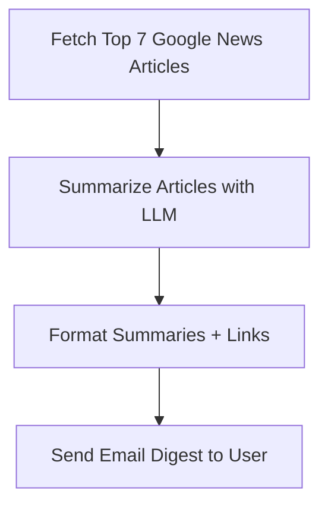

# 📰 Google News Summarizer

Google News Summarizer is a lightweight AI-powered agent that helps you keep up with the day’s news without feeling overwhelmed.  

Each day, it:  
- Fetches the **top 7 Google News articles**  
- Generates **clear, concise summaries** of each  
- Sends you an **email digest** with all 7 summaries  
- Provides **direct links** to the original articles if you want to dive deeper  

In a world where information overload is constant, this tool delivers the news straight to your inbox in a simplified, easy-to-read format.  

---

## ✨ Features
- 📩 Automated daily email delivery  
- 📰 Summarization of top 7 articles from Google News  
- 🔗 Links to full articles included  
- 🤖 Built with Python and LLMs  

---

## 🚀 Getting Started

### 1. Clone the repo
```bash
git clone https://github.com/myrithwik/GoogleNewsSummarizer.git
cd GoogleNewsSummarizer
```

### 2. Create and activate a virtual environment
```bash
# Create venv
python -m venv venv

# Activate venv
source venv/bin/activate   # Mac/Linux
venv\Scripts\activate      # Windows
```

### 3. Install dependencies
```bash
pip install -r requirements.txt
```

### 4. Configure environment variables
Create a `.env` file in the project root with your credentials:
```
EMAIL_ADDRESS=your_email@example.com
EMAIL_PASSWORD=your_password_or_app_key
OPENAI_API_KEY=your_openai_api_key
```

*(If you’re using Gmail, generate an [App Password](https://support.google.com/accounts/answer/185833) instead of your actual password.)*

### 5. Run the summarizer
```bash
python main.py
```
### 6. (Optional) Schedule automatic daily runs
You can schedule the script to run automatically each morning:

- **On Linux/macOS (using `cron`):**
```bash
crontab -e
```
Add a line like this to run every day at 8 AM:
```
0 8 * * * /path/to/venv/bin/python /path/to/GoogleNewsSummarizer/google_news_scraper.py
```

### 📊 Usage Diagram


